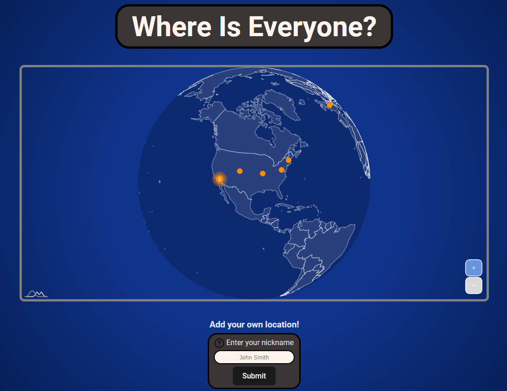

# Where Is Everyone?

This project is designed to showcase the full stack concepts I've been learning.

The site itself was created using React via [Vite](https://vite.dev/).

The globe is a map chart from [amCharts](https://www.amcharts.com/docs/v5/).

The data visible on the map is stored on a [Supabase](https://supabase.com) database.

